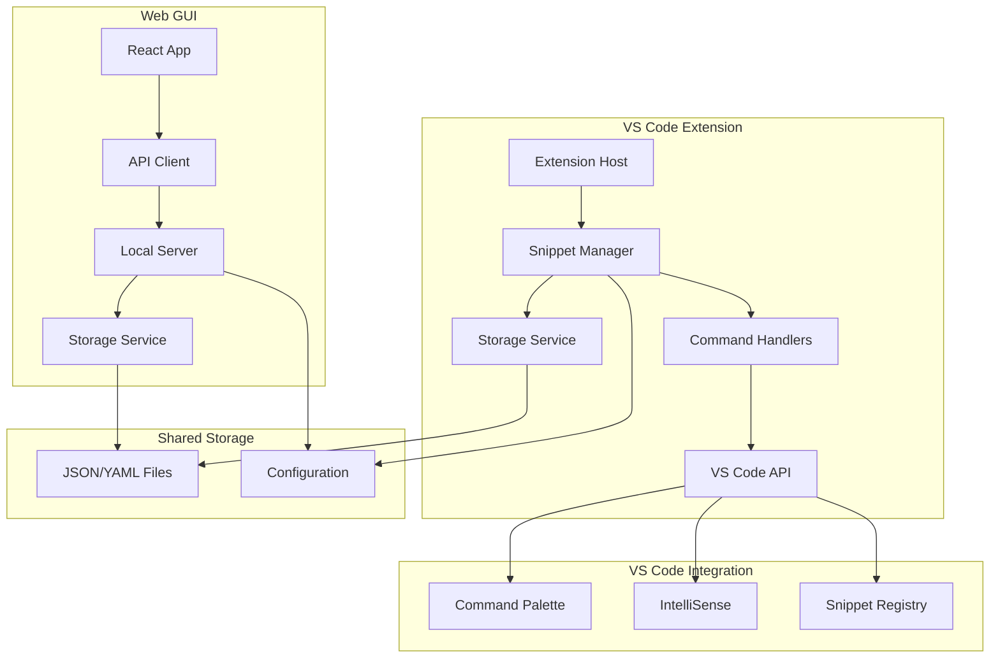

# Design Document

## Overview

The Snippet Library system consists of two main components: a VS Code extension as the primary interface and a web GUI for advanced management. The architecture follows a shared storage model where both interfaces operate on the same local file system, ensuring data consistency and seamless user experience.

The system is designed with modularity in mind, allowing the web GUI to be optional while maintaining full functionality through the VS Code extension alone. The core business logic is shared between both interfaces through a common TypeScript library.

## Architecture

### High-Level Architecture



### Component Interaction Flow

1. **VS Code Extension**: Primary interface for snippet operations during development
2. **Web GUI**: Secondary interface for bulk management and visual organization
3. **Shared Storage**: Single source of truth for all snippet data
4. **Local Server**: Bridges web GUI with local file system when needed

## Components and Interfaces

### Core Components

#### 1. Snippet Manager (Shared Core)

**Purpose**: Central business logic for snippet operations

**Responsibilities**:

- CRUD operations for snippets
- Search and filtering logic
- Validation and error handling
- Import/export functionality

**Interface**:

```typescript
interface SnippetManager {
  createSnippet(snippet: SnippetData): Promise<Snippet>;
  getSnippet(id: string): Promise<Snippet | null>;
  updateSnippet(id: string, updates: Partial<SnippetData>): Promise<Snippet>;
  deleteSnippet(id: string): Promise<boolean>;
  searchSnippets(query: SearchQuery): Promise<Snippet[]>;
  importSnippets(data: ImportData): Promise<ImportResult>;
  exportSnippets(filter?: ExportFilter): Promise<ExportData>;
}
```

#### 2. Storage Service

**Purpose**: Handles persistence and file system operations

**Responsibilities**:

- Read/write snippet files
- Handle workspace vs global storage
- File watching for external changes
- Backup and recovery

**Interface**:

```typescript
interface StorageService {
  loadSnippets(): Promise<Snippet[]>;
  saveSnippets(snippets: Snippet[]): Promise<void>;
  watchChanges(callback: (changes: StorageChange[]) => void): void;
  getStorageLocation(): StorageLocation;
  setStorageLocation(location: StorageLocation): Promise<void>;
}
```

#### 3. VS Code Extension Host

**Purpose**: VS Code-specific integration and command handling

**Responsibilities**:

- Register commands and keybindings
- Handle VS Code snippet integration
- Manage extension lifecycle
- Provide Command Palette integration

**Key Commands**:

- `snippetLibrary.saveSnippet`: Save selected code as snippet
- `snippetLibrary.insertSnippet`: Open snippet picker
- `snippetLibrary.manageSnippets`: Open management interface
- `snippetLibrary.openWebGUI`: Launch web interface

#### 4. Web GUI Server

**Purpose**: Local HTTP server for web interface

**Responsibilities**:

- Serve React application
- Provide REST API for snippet operations
- Handle file uploads/downloads
- Manage server lifecycle

**API Endpoints**:

```
GET    /api/snippets          - List all snippets
POST   /api/snippets          - Create new snippet
GET    /api/snippets/:id      - Get specific snippet
PUT    /api/snippets/:id      - Update snippet
DELETE /api/snippets/:id      - Delete snippet
POST   /api/snippets/search   - Search snippets
POST   /api/snippets/import   - Import snippets
GET    /api/snippets/export   - Export snippets
```

#### 5. React Web Application

**Purpose**: Visual interface for snippet management

**Key Components**:

- `SnippetGrid`: Visual snippet browser with filtering
- `SnippetEditor`: Form for creating/editing snippets
- `BulkOperations`: Multi-select and bulk actions
- `SearchInterface`: Advanced search and filtering
- `ImportExport`: File handling for backup/restore

## Data Models

### Core Data Structures

#### Snippet Model

```typescript
interface Snippet {
  id: string;
  title: string;
  description: string;
  code: string;
  language: string;
  tags: string[];
  category?: string;
  createdAt: Date;
  updatedAt: Date;
  usageCount: number;
  prefix?: string; // For VS Code snippet integration
  scope?: string[]; // File types where snippet is available
}
```

#### Search Query Model

```typescript
interface SearchQuery {
  text?: string;
  language?: string;
  tags?: string[];
  category?: string;
  dateRange?: {
    start: Date;
    end: Date;
  };
  sortBy?: "title" | "createdAt" | "usageCount";
  sortOrder?: "asc" | "desc";
}
```

#### Storage Configuration

```typescript
interface StorageConfig {
  location: "workspace" | "global";
  path?: string;
  format: "json" | "yaml";
  autoBackup: boolean;
  backupInterval: number;
}
```

### File System Structure

```
Workspace Storage:
.vscode/
  snippets/
    snippets.json
    config.json
    backups/

Global Storage:
~/.vscode/extensions/snippet-library/
  snippets.json
  config.json
  backups/
```

## Error Handling

### Error Categories

1. **Storage Errors**: File system access, corruption, permissions
2. **Validation Errors**: Invalid snippet data, malformed imports
3. **Sync Errors**: Conflicts between VS Code and web GUI
4. **Network Errors**: Web GUI server communication issues

### Error Handling Strategy

#### VS Code Extension

- Use VS Code's notification system for user feedback
- Graceful degradation when storage is unavailable
- Automatic retry for transient failures
- Detailed logging for debugging

#### Web GUI

- Toast notifications for operation feedback
- Form validation with inline error messages
- Retry mechanisms for API calls
- Offline mode when server is unavailable

#### Shared Error Types

```typescript
enum ErrorType {
  STORAGE_ACCESS = "storage_access",
  VALIDATION = "validation",
  SYNC_CONFLICT = "sync_conflict",
  NETWORK = "network",
  UNKNOWN = "unknown",
}

interface SnippetError {
  type: ErrorType;
  message: string;
  details?: any;
  recoverable: boolean;
  suggestedAction?: string;
}
```

## Testing Strategy

### Unit Testing

**VS Code Extension**:

- Mock VS Code API for isolated testing
- Test snippet manager business logic
- Test storage service with temporary files
- Test command handlers and integration points

**Web GUI**:

- React component testing with React Testing Library
- API client testing with mock server
- Redux store testing for state management
- Integration testing for component interactions

**Shared Core**:

- Pure function testing for business logic
- Mock storage for service testing
- Edge case testing for validation
- Performance testing for large snippet collections

### Integration Testing

**Cross-Interface Testing**:

- Test synchronization between VS Code and web GUI
- Test concurrent access scenarios
- Test import/export compatibility
- Test storage migration scenarios

**VS Code Integration**:

- Test snippet registration with VS Code
- Test Command Palette integration
- Test IntelliSense integration
- Test keybinding functionality

### End-to-End Testing

**User Workflow Testing**:

- Complete snippet lifecycle (create, edit, use, delete)
- Import/export workflows
- Search and filtering scenarios
- Bulk operations in web GUI

**Performance Testing**:

- Large snippet collection handling (1000+ snippets)
- Search performance with complex queries
- File system performance with frequent saves
- Memory usage during extended sessions

### Test Environment Setup

```typescript
// Test utilities for consistent testing
interface TestEnvironment {
  createMockVSCode(): MockVSCodeAPI;
  createTempStorage(): TempStorageService;
  createTestSnippets(count: number): Snippet[];
  setupWebGUIServer(): TestServer;
}
```

The testing strategy ensures reliability across both interfaces while maintaining performance and user experience standards. Each component is tested in isolation and as part of the integrated system to catch both unit-level bugs and integration issues.
